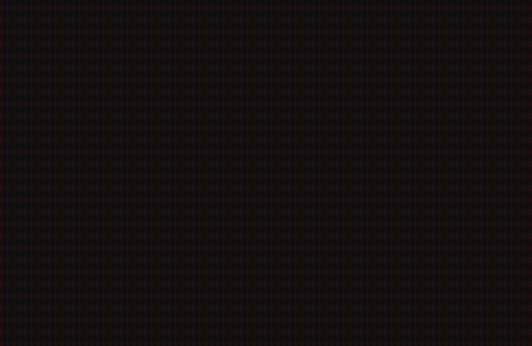

# matrixRain
Digital Rain, Matrix style. HTML+CSS+JS only.

This is an animation to create something similar to the Digital Rain from the Matrix movies.

It's based on https://codepen.io/yaclive/pen/EayLYO by Clive Cooper, I just edited the letters variable and did a few changes, such as adding the CRT filter. 

You can:
- Remove the CRT filters, by removing the class (in the HTML) or the class properties (in the CSS).
- Change the letters variable to whichever symbols/letters you'd like (in the JS).
-- It currently has several different symbols, letters and characters that I liked.
- Change the ctx.font (in the JS) to have a different type of font, size or style.
-- The font is currently bold, to make go better with the CRT style, I also used a dragon_alphabet font, which is based on the Skyrim game. 
- Change the color, it's currently set to select randomly from 3 types of green held in the colors list (in the JS).

You can change and experiment around with it, have fun!
